# HsAd4DDR
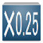  
音楽ゲーム「ダンスダンスレボリューション」のハイスピード設定の補助を行うAndroidアプリケーションのソースコード

## 概要
### 開発背景
**【注意】このゲームをやった事が無ければ飛ばして貰って構いません。**  
  
ダンスダンスレボリューションは画面上に流れてくる4つあるいは8つの下から上に流れてくる矢印が判定エリアに重なるタイミングに合わせ、足元のパネルを踏む事をコンセプトにした音楽ゲームである。  
  
このゲームは画面上に流れる矢印をどのタイミングで踏めば良いのか頭の中で認識する事がポイントとなり、なるべく「画面内の矢印の数が少ないほど見やすくタイミングが把握しやすくなる」。  
しかし徐々にレベルが高くなるに連れ、以下の図のような尋常ではない数の矢印が表示されるような状況もある。  
  
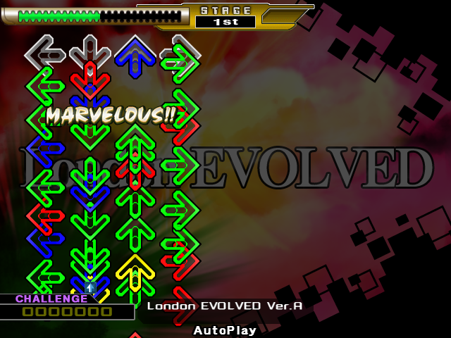  
  
よって、詰まりすぎた矢印同士の間隔を広げる事で、ある程度矢印を見やすくするように事前に対策を練っておく必要が出てくる。  
  
こうした「矢印の見やすさを補う設定」として、オプション画面のコラムにある**矢印の速度**(通称**ハイスピード、ハイスピ、High Speed**)の事前設定が、中級者以降のゲームプレイヤーにとってキーとなってくる(参考 : [DanceDanceRevolution | eAMUSEMENTの「オプション選択」](http://p.eagate.573.jp/game/ddr/ac/p/howto/index.html))。  
この設定は倍率として定義され、以下の画面キャプチャにおける水色の丸い部分で確認することができる。  
  
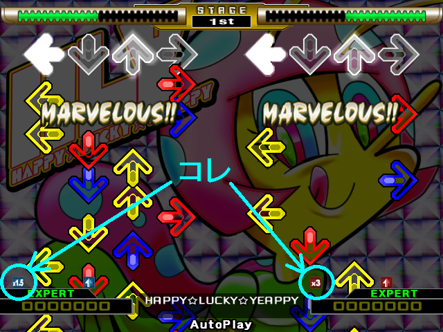  
  
例えばこの図だと、左側のプレーヤーの倍率は「×1.5」で右側は「×3」と設定されている。  
この倍率を高くすると下から上に流れる矢印のスピードが早くなり、その結果として上図のように矢印同士の間隔が広くなってタイミングが把握しやすくなる。  
以後、「倍率」ではなく通称表現の「ハイスピード」として呼ぶこととする。  
  
ハイスピードは曲ごとに異なる「曲自身のスピード」によって変更する必要があり、それは**BPM**(Beats Per Minute)と呼ばれる「1分間あたりに刻まれる拍の数」として定量的に表されている(参考 : [テンポ - Wikipedia](http://ja.wikipedia.org/wiki/%E3%83%86%E3%83%B3%E3%83%9D))。  
この曲ごとに異なる値を持つBPMにハイスピードを乗じた値によって、画面上に流れる矢印の見やすさを定量的に評価できる。この値を**調整後BPM**と定義する。  
例えば、

* BPM150の曲にハイスピード×3.5をセットした場合の調整後BPMは 150 × 3.5 = 525

* BPM175の曲にハイスピード×3をセットした場合の調整後BPMは 175 × 3 = 525

となり、両方とも調整後BPMが同じ値なので画面上に流れる矢印の見やすさは同程度である。

### 開発目的

このAndroidアプリケーションは「目視で矢印のスピードに追いついていける調整後BPMの最大値」である**BPM適正値**に則って、どのBPMにはどのハイスピードを設定すれば良いのか表示する**調整表**と、BPM適正値を伸ばす練習ができる曲をSQLite3を用いたデータベースから表示される**閾値表**を実装している。

### 開発理由
* 私自身がこのゲームをやっており、倍率を設定するときに上記の掛け算を暗算でやるのが面倒だったから。
	- 例えばBPM173の曲に倍率を設定するとき、「173×3.25って大体どのくらいだっけ」のような状況が頻繁に発生する。
	- 結構体力を消費するゲームなので、ヘトヘトの中で暗算するのは心身ともにキツい。

* Androidアプリケーション制作の復習をやりたかったから。
	- 初めて開発を経験したのが2012年8月頃。
	- このアプリケーションを開発したいと考えたのは2014年8月頃。
	- Androidアプリケーション制作の復習としては絶好の機会。

## 使用・必要環境
* 最小Android APIレベルは**8**。
	- つまり、このアプリケーションを起動させるのに必要なAndroidのOSバージョンは**2.2.x**以上。
* 使用対象Android APIレベルは**21**。
* 参考 : [Android Developers](http://developer.android.com/guide/topics/manifest/uses-sdk-element.html#ApiLevels)

## 初期設定
最初にこのアプリケーションを起動すると、以下のようにタブの切り替えによって適性表と閾値表が表示される。  
  
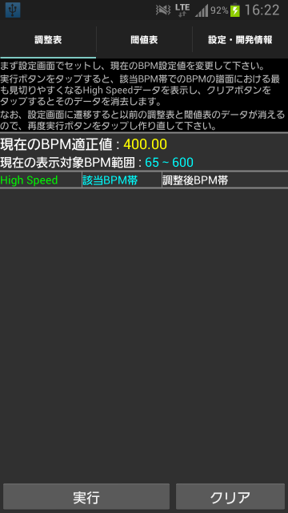
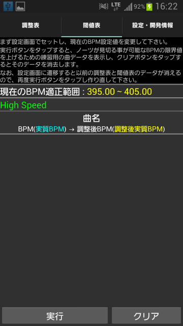  
  
このまま下部の実行ボタンで表を表示してもBPM適正値などの設定が合ってないので、後述の設定を自分で行う必要がある。

### ユーザー設定値変更
画面上部にある「設定・開発情報」タブ、またはメニュー画面の「設定・開発情報」をタップして出てくる**ユーザー設定値変更**をタップ。  
  
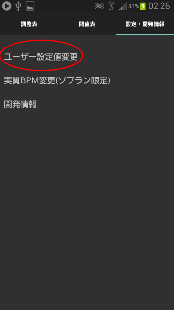
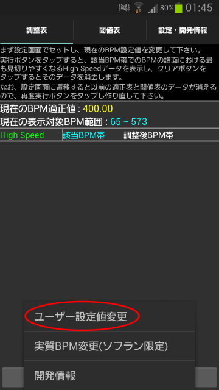  
  
以下のようなユーザー設定画面が表示され、以下に載っている設定値を適宜変更する。  
  
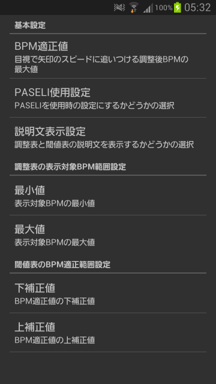  
  
* **【基本設定】** : BPM適正値
	- 目視で矢印のスピードに追いつける調整後BPMの最大値。
	- デフォルト値は**400.0**。
	- 正の実数値のみ入力可能。

* **【基本設定】** : PASELI使用設定
	- ゲームを遊ぶとき電子マネーのPASELIを使用するかどうか選択。
	- デフォルトは**PASELI未使用**。

* **【基本設定】** : 説明文表示設定
	- 調整表と閾値表の上部にある説明文を表示するかどうか選択。
	- デフォルトは**説明文表示**。

* **【調整表の表示対象BPM範囲設定】** : 最小値&最大値
	- 調整表での表示対象BPM範囲を指定するパラメータ。
	- デフォルト値はそれぞれbagのBPMとMAX.(period)の最大BPMである**65**と**600**。
	- 両方とも正の整数値のみ入力可能。
	- 調整表に表示される「現在の表示対象BPM範囲」が**(最小値)** 〜 **(最大値)**と表示。

* **【閾値表のBPM適正範囲設定】** : 下補正値&上補正値
	- 閾値表でのBPM適正範囲でBPM適正値から補正されるパラメータ。
	- デフォルト値は両方とも**5.0**。
	- 両方とも0以上の実数値のみ入力可能。
	- 閾値表に表示される「現在のBPM適正範囲」が**(BPM適正値) - (下補正値)** 〜 **(BPM適正値) + (上補正値)**と表示。
	- なお、両方とも「0.0」にセットすると、閾値表に表示される「現在のBPM適正範囲」が**(BPM適正値)**と表示。

## 使用例
このコラムでは、以下のようなユーザー設定値を想定する。  
  
|         設定名 |    設定値    |
|---------------:|:------------:|
|      BPM適正値 |     580.0    |
| PASELI使用条件 |  PASELI使用  |
| 説明文表示条件 | 説明文非表示 |
|         最小値 |      65      |
|         最大値 |      600     |
|       下補正値 |      2.5     |
|       上補正値 |      0.0     |

### 調整表
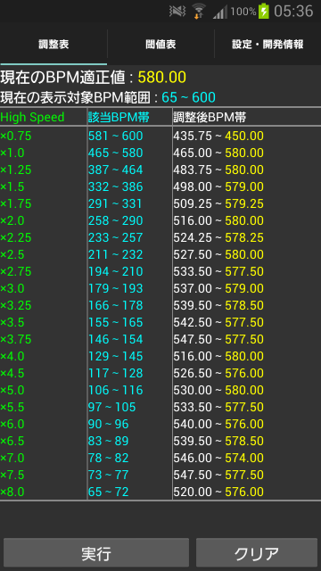  
  
**実行**ボタンをタップすると、BPMが65〜600のそれぞれの曲に最も矢印が見やすくなるハイスピードの設定情報が載っている表の表示、更新を行う。  
BPM適正値の580.0を超えないように、調整後BPM最も大きくなるようなハイスピードの倍率を返すアルゴリズムによって求めている。  
例えばBPM185.0の曲には、該当BPM帯の列から180を含む「179〜193」の行を探し、隣に書いてある「×3.0」の通りにハイスピードをセットすれば良い。
**クリア**ボタンをタップすると、現在表示されている表のレイアウトとデータを全て削除する。  

### 閾値表
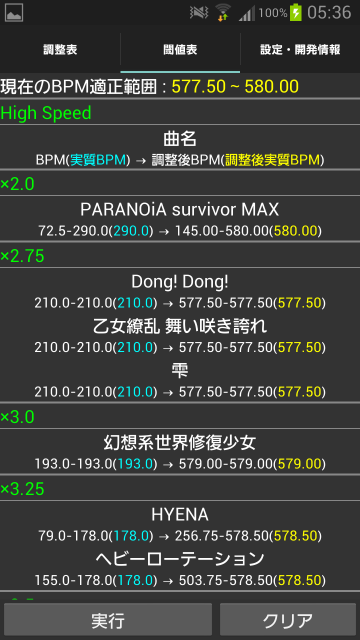  
  
**実行**ボタンをタップすると、調整後BPMが575.0〜580.0となるハイスピードと曲の情報が載っている表の表示、更新を行う。  
設定できる全てのハイスピードの倍率の場合において、調整後BPMが575.0〜580.0である曲とそのBPMの情報を返すクエリをSQLite3で実行し、抽出結果のデータを返すアルゴリズムによって求めている。  
例えば一番上にある「PARANOiA survivor MAX」の曲でハイスピードを「×2.0」で設定すると矢印がギリギリ目視で見えるかどうかの早いスピードで流れるので、俗に呼ばれる**高速耐性**を付ける練習として最適である。  
これを応用すると、SUDDEN+をセットせずに**低速耐性**を付ける練習曲を出力する事も可能。
**クリア**ボタンをタップすると、現在表示されている表のレイアウトとデータを全て削除する。  

## 【発展】実質BPM変更
データベースに登録されている全ての曲には**実質BPM**が事前に正の実数値として設定されている。  
大概の曲はそのBPMがそのまま実質BPMとして設定され、ユーザーが任意の値に変更できない。  
しかし「途中にBPMが変動するギミック(通称**ソフラン**)を含む曲」のみ、実質BPMを変更することを許すような仕様になっている。  
ソフランを含む曲のデフォルトの実質BPMは、「一瞬だけ物凄く大きいBPMになるギミック(e.g. Pluto Relinquish、888、REVOLUTIONARY ADDICT)を除いたときの最大BPM値」として設定されている。  
例えばMAXX UNLIMITEDは320、Pluto Relinquishは400として設定されている。
  
以下は、ソフランを含む曲の実質BPMの変更方法の一例として「Tohoku EVOLVED」を挙げて説明することにする。  
この曲は実質BPMが42.5〜1020.0の間で変更でき、デフォルトの実質BPMは340.0である。  
しかしこの曲は一部BPM680.0になって矢印が飛んでくることがあり、その部分に調整後BPMをリンク付けたい場合を想定する。  
  
**【注意】ここまでの文章で何言っているのか分からない場合は、極力以下の実質BPM変更をしないで下さい！**
  
画面上部にある「設定・開発情報」タブ、またはメニュー画面の「設定・開発情報」をタップして出てくる**実質BPM変更(ソフラン限定)**をタップ。  
  
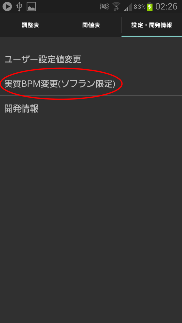
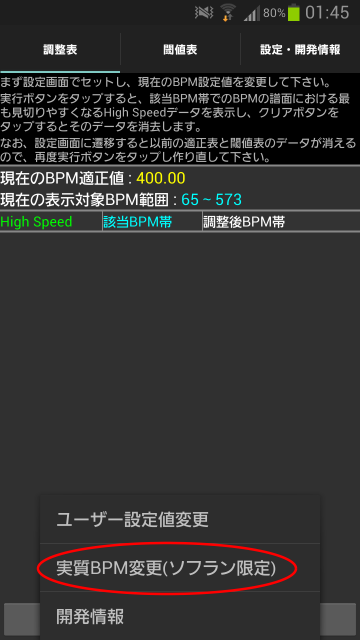  
  
以下の新しい`Activity`が起動するので、**頭文字のアルファベット順でソート**をタップ。  
  
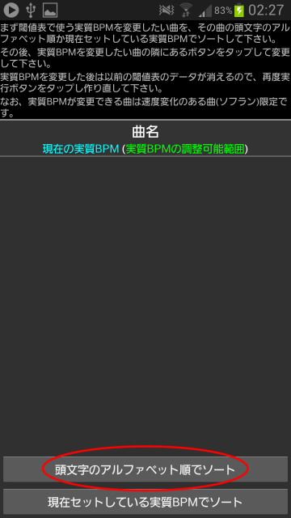  
  
「Tohoku EVOLVED」の頭文字である**T**を選択して、**実行**ボタンをタップ。  
  
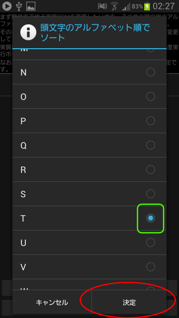  
  
Tで始まるソフランを含む曲が全て表示されるので、「Tohoku EVOLVED」の隣にある**変更**ボタンをタップ。  
  
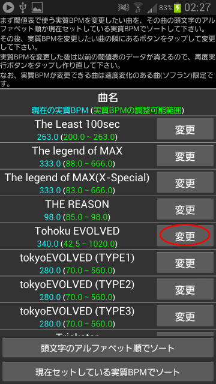  
  
**【補足】**新しい`Activity`が起動してから、「現在セットしている実質BPMでソート」をタップ→「Tohoku EVOLVED」の実質BPMのデフォルト値である340.0を含む「300以上」をタップ→表示された「Tohoku EVOLVED」の隣にある「変更」ボタンをタップしても良く、同様の操作となる。  
  
実質BPMを42.5〜1020.0の範囲内の数値を入力して、**変更**ボタンをタップ。
  
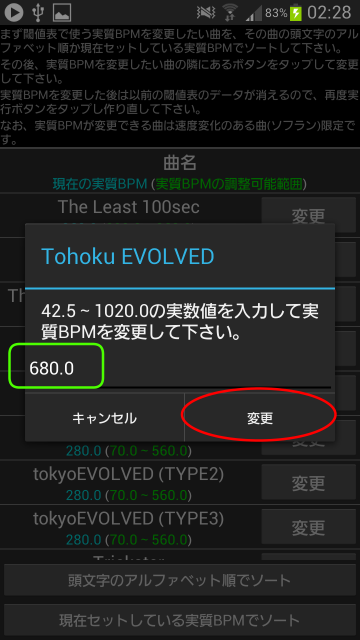  
  
実質BPMを変更した旨の`Toast`が表示され、これで完了。  
なお別のソフランを含む曲の実質BPMを変更する場合は、もう一度ソートからやり直す必要がある。  
  
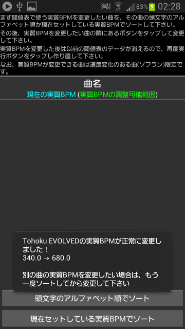  

## 既知の問題点・開発予定
* `Preferences.java`に存在する`@SuppressWarnings("deprecation")`への対策。
	- 原因は`android.preference.PreferenceActivity`をインポートし、そのクラスに存在する`addPreferencesFromResource()`関数を使用しているため。
	- このアプリケーションの最小Android APKレベルが**8**であり、それに合わせてv4 Support Libraryを使用したFragmentを切り替える仕様となっている。
	- しかし、v4 Support Libraryでは何故か`PreferenceFragment`が搭載されていない。
	- Android APIレベル11から登場した`android.preference.PreferenceFragment`を使えば解決するが、最小Android APIレベルを8→11に変更しなければならず、Android2.xへの対応が厳しくなる
	- 参考 : [【Android】PreferenceFragmentがsupport-v4に含まれていない？？ - Kuwappブログ-アプリ開発記](http://yusuke-hata.hatenablog.com/entry/2014/11/12/000605)

* `MainActivity.java`に存在する`@SuppressWarnings("deprecation")`への対策。
	- 使用対象Android APIレベルを19→21に変更したら、突如`import android.support.v7.app.ActionBar.Tab`のクラス自体がdeprecationであると怒られた。
	- 現在原因調査中。
	- 場合によっては使用対象 APIレベルを21→19に戻すかもしれない。

* `HSAdjustmentDDR/assets/DDRSongData.db`の更新方法。
	- `HSAdjustmentDDR/assets/DDRSongData.db`はゲームに収録されてる曲の名前とBPM情報を格納するベータベースファイル。
	- `HSAdjustmentDDR/assets/DDRSongData.db`の内容を変更して、アプリケーションをインストールし直しても、何故かそのデータベースファイル内容の更新が反映されていない。
	- もしかしたら、上記のインストールを行ってもassetsフォルダ内の内容が上書き保存されない仕様？要調査。
	- 変更前のアプリケーションを端末でアンインストールし、変更後のアプリケーションを再度インストールすると、assetsフォルダ内の変更後の内容が反映されている。
	- この対策として考えている事は、「このレポジトリーにある新しい`HSAdjustmentDDR/assets/DDRSongData.db`をダウンロード→古い`HSAdjustmentDDR/assets/DDRSongData.db`からダウンロードした新しい`HSAdjustmentDDR/assets/DDRSongData.db`へ上書き保存」の動作を実装すること。

* オプション画面のコラムにある「見え方」で設定できる**SUDDEN+**への対応。
	- 画面下部をレーンカバーで任意の高さまで隠し、矢印を見やすくする効果が期待できるオプション。
	- 参考 : [細かすぎて伝わらない機能あれこれ ～その２～ -AC](http://mp.i-revo.jp/user.php/ddr/entry/327.html)
	- プレーヤーによってSUDDEN+が有効な曲が異なり、Healing-D-Visionや888などのごく一部の曲しか有効になれない。
	- どの程度SUDDEN+のシャッターを上げるべきか定量化が厳しいため、実装が困難。
